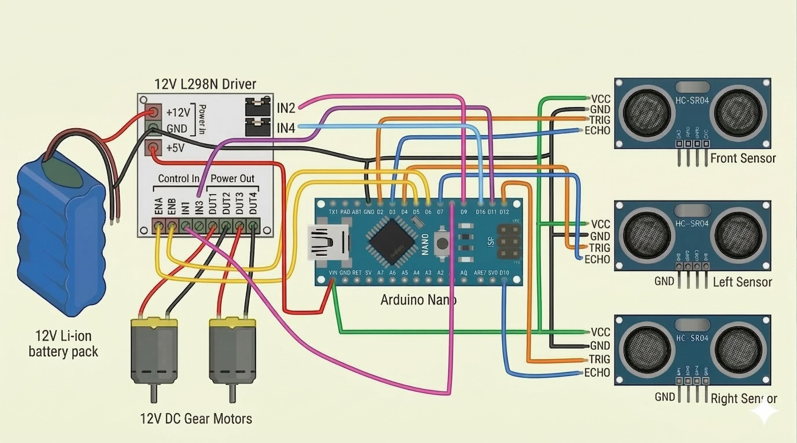

### 📄 Circuit Diagram & Connections

### 🔧 Components Used
- Arduino Nano
- L298N Motor Driver Module
- 2 × DC Motors
- 3 × Ultrasonic Sensors (HC-SR04)
- Battery (7.4V–12V recommended)
- Connecting Wires

### 🔌 Circuit Diagram

### ⚡ Power Connections
- Battery positive (+) → L298N 12V
- Battery negative (−) → L298N GND
- L298N GND → Arduino Nano GND (common ground)
- L298N 5V → Arduino Nano 5V

### 🔄 Motor Connections
- Motor A
  - Connected to OUT1 and OUT2
- Motor B
  - Connected to OUT3 and OUT4
 
### Ultrasonic Sensor Connections
- VCC → Arduino Nano 5V
- GND → Arduino Nano GND
- Front Sensor
  - Trig → D2
  - Echo → D3
- Left Sensor
  - Trig → D4
  - Echo → D7
- Right Sensor
  - Trig → D12
  - Echo → D10

### 🎮 Control Pins (Arduino Nano ↔ L298N)
- ENA → D5
- IN1 → D8
- IN2 → D9
- ENB → D6
- IN3 → D11
- IN4 → D13
