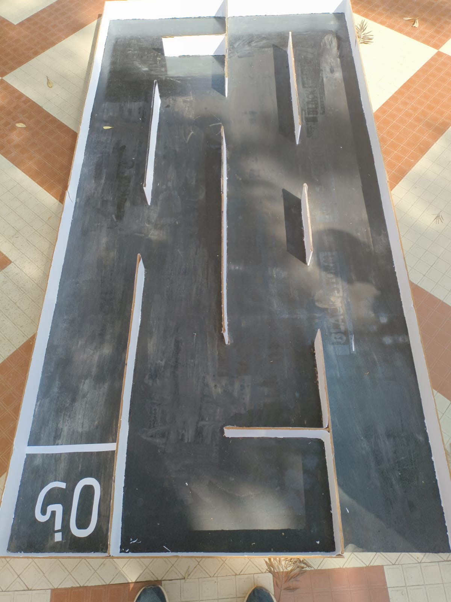
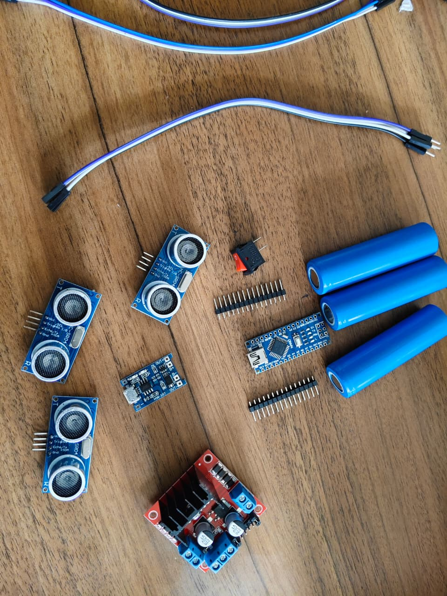
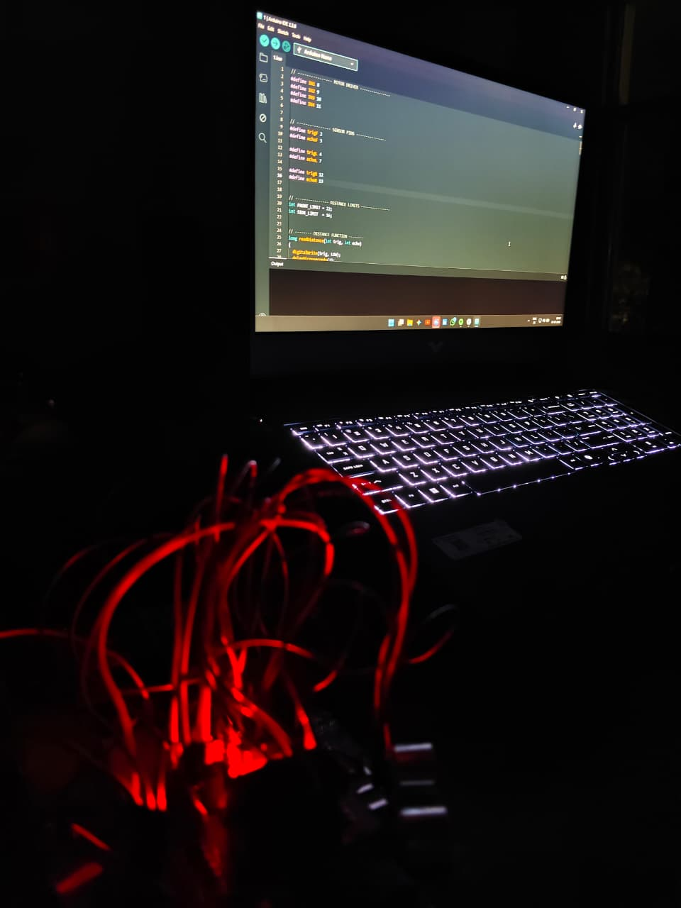

### 🏎️ Maze Solving Car (Arduino Nano)

 

### ⚠️ Note
In the images, side sensors are not at 90°, but were later adjusted.

---

### 🚀 Overview
This project is an autonomous maze solving car that can navigate through a maze without human control. It uses ultrasonic sensors to detect walls and follows the left-hand rule algorithm to reach the exit.

---

### 🎯 Objective
To build a robot that can automatically detect walls, make decisions, and solve a maze in minimum time.

---

### 🧠 Working Principle
The car uses three ultrasonic sensors (front, left, right) to measure distance from walls.
  - If left is open → turn left
  - If left blocked & front clear → move forward
  - If front too close → slow down
  - If front & left blocked → turn right
  - If all blocked → turn back
It also adjusts motor speed to maintain proper distance from walls.

📄[Deep Details](https://docs.google.com/document/d/1Hwybd47RWbEQwikpHtToCMwK--V-l5DWp2h7iHspnp0/edit?usp=sharing)

---

### 🔌 Components Used
- Arduino Nano
- L298N Motor Driver
- 3 × Ultrasonic Sensors (HC-SR04)
- 2 × DC Motors
- Battery
- Chassis

---

### 🔌 Circuit Connections
📄[View circuit Connections and Diagram](circuit.md)

---

### 🧾 Code
The Arduino code reads sensor data and controls motors using PWM and decision logic.

Main functions:
  - moveForward()
  - turnLeft()
  - turnRight()
  - turnBack()
  - stopBot()

[View Code](code/main.ino)

---

### 📸 Images

 
 
 

### ⚠️ Note
In the images, side sensors are not at 90°, but were later adjusted.
